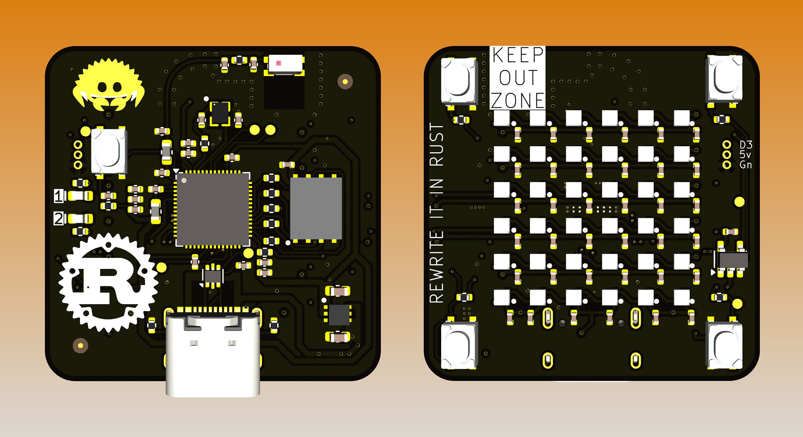
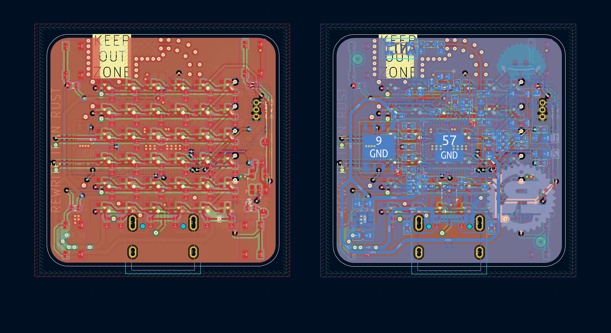
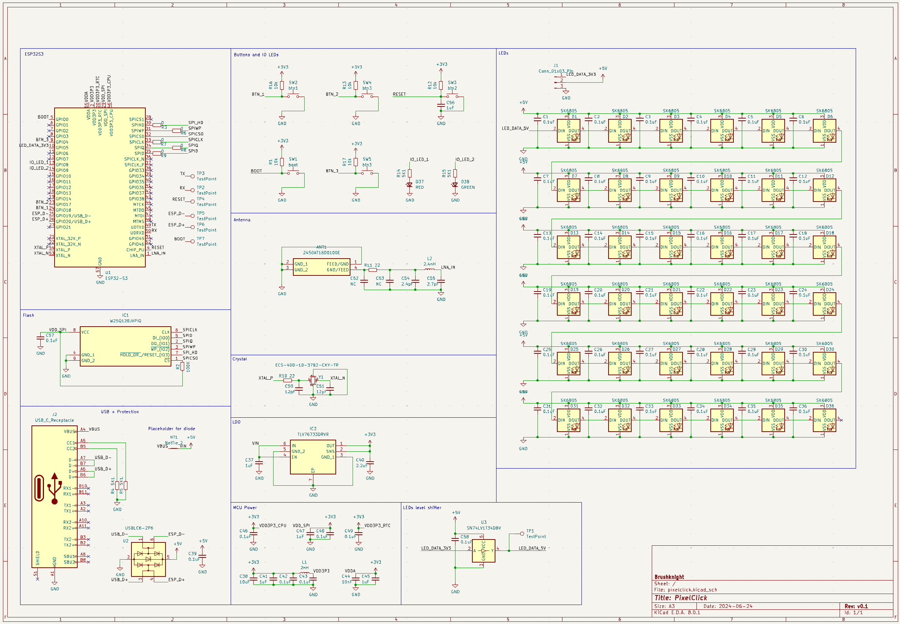

# PixelClick

PixelClick is a tiny (33x33mm) LED matrix (6x6) with 4 buttons and ESP32S3 N16R8. It can be programmed with usb-c and any computer.

## Possible USE cases
- **Status light**. It can be used to reflect your current status. Are you on the meeting or working in a flow, it can reflect it with click of a button. Pair 2 PixelClick and one can be used as a controller and second as a notification light outside of the office room.
- **Pomodoro timer** with fixed working time and interval time. It can change the color or play animations based on the current mode.
- **Simple game**. You can make a simple game to test your reaction.
- **ESPHOME** light and a button, can be a fancy door bell or any other smart button.

## List of features
- 36 adressable LEDs sk6805
- 4 buttons on the front side (one of buttons is IO0)
- 2 programmable LEDs for blick the led programms (hello world) or some debug
- 1 reset button on the back
- ESP32S3 R8 as a main brain, right in the center
- 16MB flash
- Chip antenna for WiFi and BT
- ESD protection for USB
- USB-C for data and power

## Programming

This board is compatible with C++ (Arduino) and Rust

Code examples will be provided soon.

## PCB

PCB KiCAD 8 files are available for [Patreon Partners](https://www.patreon.com/brushknight_maker).

### PCB layout

### PCB schematics

For better quality of the pcb schematics, check this [PDF](./pcb/schematics.pdf)

### PCB BOM (components) file
[ibom.html](./pcb/ibom.html)